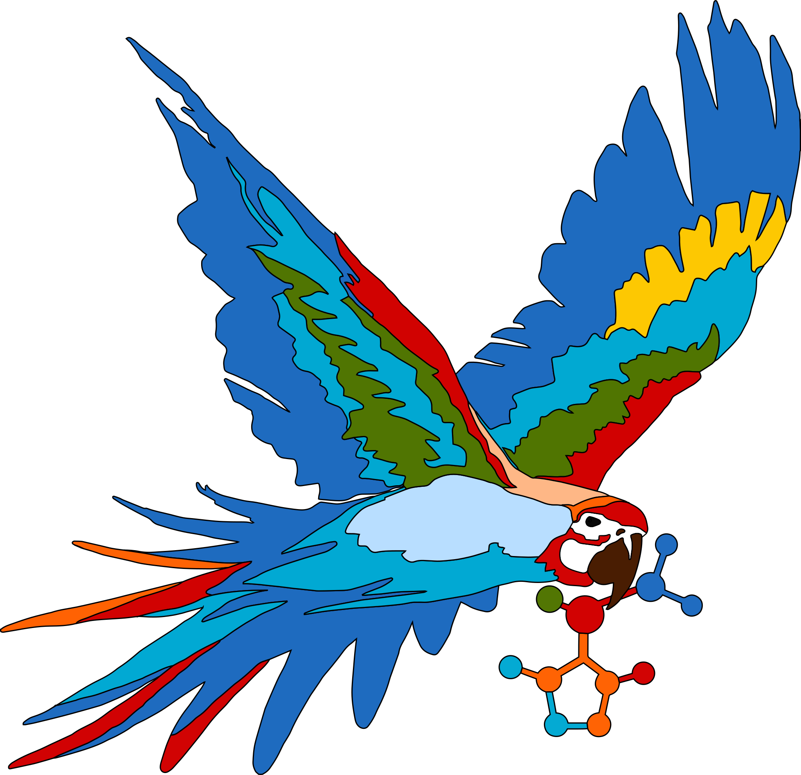

<div align="center">

<p>Logo: Nicole Maser</p>
</div>

[](https://badge.fury.io/py/Molara)
[](https://github.com/Molara-Lab/Molara/actions/workflows/test.yml)
[](https://codecov.io/gh/Molara-Lab/Molara)
[](https://results.pre-commit.ci/latest/github/Molara-Lab/Molara/main)
[](https://zenodo.org/records/11120926)

# Molara

Molara is an open-source program for the 3-dimensional visualization of molecules and crystal structures. These are some of its main features:

1. Import of .xyz, .coord, and POSCAR files
2. Export of rendered structures as raster graphics
3. Tools for creating custom molecular and crystal structures
4. Animation of trajectories
5. Display of molecular orbitals from molden files (currently Orca, Molpro, and Terachem)
6. Display of densities from cube files

New features will follow soon!

## Installation

### Simple User installation

The easiest way to install Molara is from [PyPi](https://pypi.org/project/Molara/) using pip.

```bash
pip install molara
```

After the installation, Molara can be started by calling `molara` from the command line.

### Developer installation

If you want to contribute to Molara, you should install the package directly from source. To this end, you need to clone the repository:

```bash
git clone <this repo>
cd Molara
```

>[!TIP]
>It is advisable to install Molara in a virtual Python environment.
>
>Create & activate virtual environment on Linux / Mac:
>
>```bash
>python -m venv ./venv
>source ./venv/bin/activate
>```
>
>Create & activate virtual environment on Windows:
>
>```bash
>python -m venv .\venv
>.\venv\Scripts\activate.bat
>```

Subsequently, Molara may be installed as follows.

```bash
pip install -e .
```

> [!IMPORTANT]
> The installation from source with `pip install -e .` involves a Cython build, for which it is required that a C compiler be installed on the system (a more detailed description can be found [here](https://cython.readthedocs.io/en/latest/src/quickstart/install.html)).

## Known issues

Due to Apple's non existing support for OpenGL, displaying the indices of the atoms takes long for the first time. However after that it is instantaneous, even after restarting the program and rebooting the machine. As a solution we need to rework this routine with another strategy.

## Building the documentation locally

To generate the documentation, install molara as follows:

```bash
pip install -e . molara[doc]

```

then run

```bash
cd docs
make html
```
